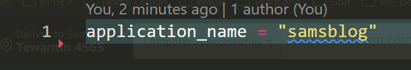

# Terraform 101 Course

This is an overview course of Terraform with labs for orchatrarting azure cloud.

## lab1-fundamentals

### Terraform Core Workflow

- terraform init
- terraform plan
- terraform apply
- terraform destroy


### Inputs

[variables.tf](lab1-fundamentals/variables.tf)


### Outputs

[outputs.tf](lab1-fundamentals/outputs.tf)


### String Interpolation

Allows to concatenate strings together, in a highly readable way
[main.tf](lab1-fundamentals/main.tf)


### Defining Required Providers

[versions.tf](lab1-fundamentals/versions.tf)


### Referencing Resource Outputs

[outputs.tf](lab1-fundamentals/outputs.tf)


[main.tf](lab1-fundamentals/main.tf)


### Default Variable Files

[default.auto.tfvars](lab1-fundamentals/default.auto.tfvars)


### Using Input Variable Files for Environment Configuration

Move the environment name to it's own tfvars file.
Note: Terraform needs the dev var file added into the command

`terraform apply -var-file dev.tfvars`

[default.auto.tfvars](lab1-fundamentals/default.auto.tfvarsf)



[dev.tfvars](lab1-fundamentals/env/dev.tfvars)


### Managing Input Variable Files for Multiple Environments

Create environment files for test.tfvars and prod.ftvrs
To load prod: `terraform apply -var-file prod.tfvars`

Group together the tfvar files and place them into the env folder.

- env/dev.tfvrs
- env/test.tfvrs
- env/prod.tfvr

To load prod: `terraform apply -var-file env/prod.tfvars`

### Seneitive Inputs and Outputs

- Passwords
- Connection strings
- API keys

[variables.tf](lab1-fundamentals/variables.tf)

```
variable api_key{
    sensitive = true
}
```

[outputs.tf](lab1-fundamentals/outputs.tf)

```
output "api_key" {
    value = var.api_key
    sensitive = true
}
```

Run terrform apply
`terraform apply -var-file env/dev.tfvars`

Even though marked as sensitive, we can still view the API output
`terraform output api_key`

Sec Note:

1. Only execute terraform from a trusted machine.
2. Employ terrfrom state backends that use data encryption.
3. Principle of least privledge is applied to state files.

### Passing Input Variable Values using Environment Variables using PowerShell
